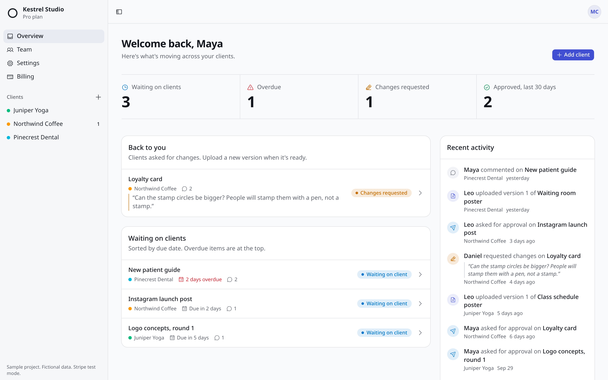
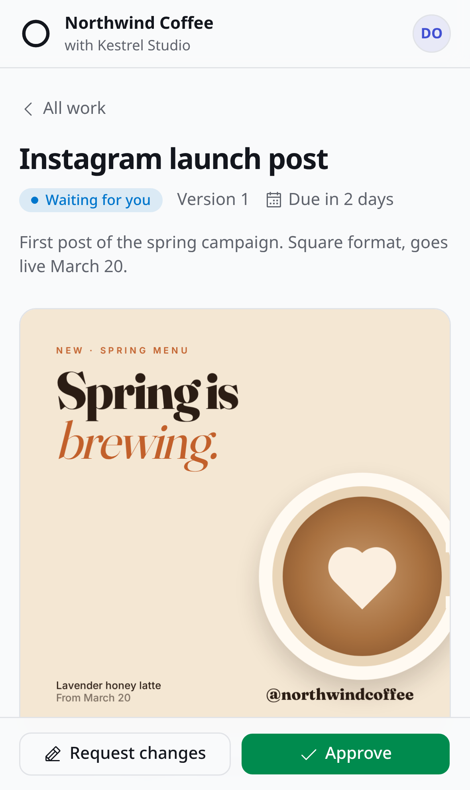

# Relaydesk

[](https://github.com/SpicyTalha/relaydesk/actions/workflows/ci.yml)

**Client approvals for creative agencies.** Every client gets a private space to review work and approve it or ask for changes from any device. Every version and every decision is saved with a name and a date.

**Live demo: [relaydesk-plum.vercel.app](https://relaydesk-plum.vercel.app)**. Click *Try it as the agency*, then *View as the client*. You get your own private copy with sample data. It's deleted after a day.

> Sample project. Relaydesk is a fictional product built end to end as a portfolio piece: the companies, people and data in the demo are invented, and payments run in Stripe test mode.



## What it does

| | |
|---|---|
| **Workspaces and roles** | An agency workspace with Owners, Teammates and Client users. Clients only ever see their own client space. |
| **Versioned deliverables** | Upload v1, v2, v3. Files go straight from the browser to a private bucket and open through short-lived signed URLs. |
| **Approvals** | The team asks for approval with a due date. The client approves or requests changes (a note is required), from a phone or a laptop. |
| **History and comments** | Every upload and decision lands in a per-deliverable timeline and an activity feed, with comments attached to versions. |
| **Invitations** | One-time links tied to one email address, valid for 7 days. Only a SHA-256 of the token is stored. |
| **Billing** | Free, Pro and Studio plans through Stripe Checkout and the Customer Portal. Plan limits are enforced by the database. |
| **Demo sandboxes** | Each visitor gets a private seeded copy of a demo agency and can switch between the agency and client views. |

<p align="center"></p>

## Architecture

```text
Browser ──> Vercel (Next.js 16 App Router, Node runtime, Cache Components)
              ├─ proxy.ts                  refreshes the Supabase session (getClaims)
              ├─ Server Components         read as the signed-in user: RLS applies
              ├─ Server Actions            zod-validated writes as the user
              ├─ /api/stripe/webhook       signature check, re-fetch, idempotent apply
              └─ /api/cron/cleanup-demo    daily, deletes demo sandboxes older than 24 h
           ──> Supabase: Postgres (RLS on every table), Auth, private Storage
           ──> Stripe (test mode): Checkout, Customer Portal, webhooks
```

The full design, data model and decisions are in **[docs/BLUEPRINT.md](docs/BLUEPRINT.md)**.

## Security and correctness

The parts that usually break first in an MVP got the most attention.

- **Row Level Security on every table, with explicit grants.** Supabase no longer exposes new tables automatically, so each table grants only the columns and verbs its policies need. `anon` has no table access at all.
- **Membership checks in one place.** `SECURITY DEFINER` helpers live in a schema the API doesn't expose and are called as `(select private.fn())`, so Postgres evaluates them once per query.
- **State changes through checked functions.** Accepting an invite, requesting approval and approving go through RPCs that check `auth.uid()` themselves. The `status` column can't be updated directly, so the agency can never approve its own work.
- **Plan limits in the database.** Client, seat and storage limits are enforced by triggers, and outsiders get a plain "permission denied" rather than details about someone else's plan.
- **Server auth uses `getClaims()`**, which verifies the JWT. `getSession()` is never trusted on the server. The service-role key is used in only three server-side places.
- **Stripe webhooks can't double-apply.** The handler verifies the signature on the raw body, re-fetches the subscription from Stripe (so late or out-of-order events converge), and a single database function records the event id and applies the change in one transaction.
- **Demo sandboxes are isolated.** Demo users have random unknown passwords. Signing in and switching roles use one-time server-generated tokens, scoped to the visitor's own copy, with a per-IP rate limit.

## Tests

| Suite | What it proves | Run |
|---|---|---|
| **pgTAP** (62 tests) | Cross-tenant reads fail, clients can't see drafts or other clients' people, roles and invites behave, plan limits hold, webhook events apply exactly once and only the server can write billing state | `pnpm test:db` |
| **Playwright** | The full approval loop (agency uploads, client requests changes on a phone, agency revises, client approves), the demo sandbox, billing UI and Checkout redirect, and the webhook against real Stripe test-mode objects | `pnpm test:e2e` |
| **Static** | TypeScript strict, ESLint with zero warnings | `pnpm typecheck && pnpm lint` |

Two security issues were found by these tests during the build and fixed: a plan-limit message that leaked another agency's plan details to outsiders, and a profile policy that let a client list people at other clients of the same agency. Both now have regression tests.

## Run it locally

Requires Node 24, pnpm and Docker.

```bash
pnpm install
supabase start && supabase db reset        # local Postgres, Auth and Storage with all migrations
cp .env.example .env.local                 # fill in the values printed by `supabase status`
pnpm dev                                   # http://localhost:3000
```

Optional: `pnpm stripe:setup` creates the plans and portal configuration in a Stripe **test** account, and `pnpm demo:upload` uploads the demo files so *Try the demo* works locally.

## Project layout

```text
src/app/                 routes: landing, auth, onboarding, /w/[slug]/... workspace, API routes
src/lib/actions/         Server Actions (zod-validated, run as the user)
src/lib/data/            server-only data loaders
src/lib/supabase/        browser, server, admin clients and the session proxy
supabase/migrations/     schema, RLS, grants, billing, demo seed
supabase/tests/database/ pgTAP tests
e2e/                     Playwright tests
demo/assets-src/         original demo artwork (HTML), rendered by scripts/render-demo-assets.mjs
docs/BLUEPRINT.md        scope, data model, security plan, decisions, cost
```

## Before a real launch

This is a demo, so a few things are deliberately simplified:

- Email confirmation is off on the demo project. A real launch turns it on with a custom SMTP provider (for example Resend), and sends invite and approval emails.
- Stripe runs in test mode. Going live needs a restricted API key, Stripe Tax registration if you sell to taxable regions, and Vercel Pro (Hobby is for non-commercial use).
- The AI revision checklist and the platform admin panel from the blueprint are the next two features.

## Tech

Next.js 16 · React 19 · TypeScript · Tailwind CSS 4 · shadcn/ui · Supabase (Postgres, Auth, Storage) · Stripe · Playwright · pgTAP · Vercel

Built by [SpicyTalha](https://github.com/SpicyTalha), with Claude Code as a pair programmer.
